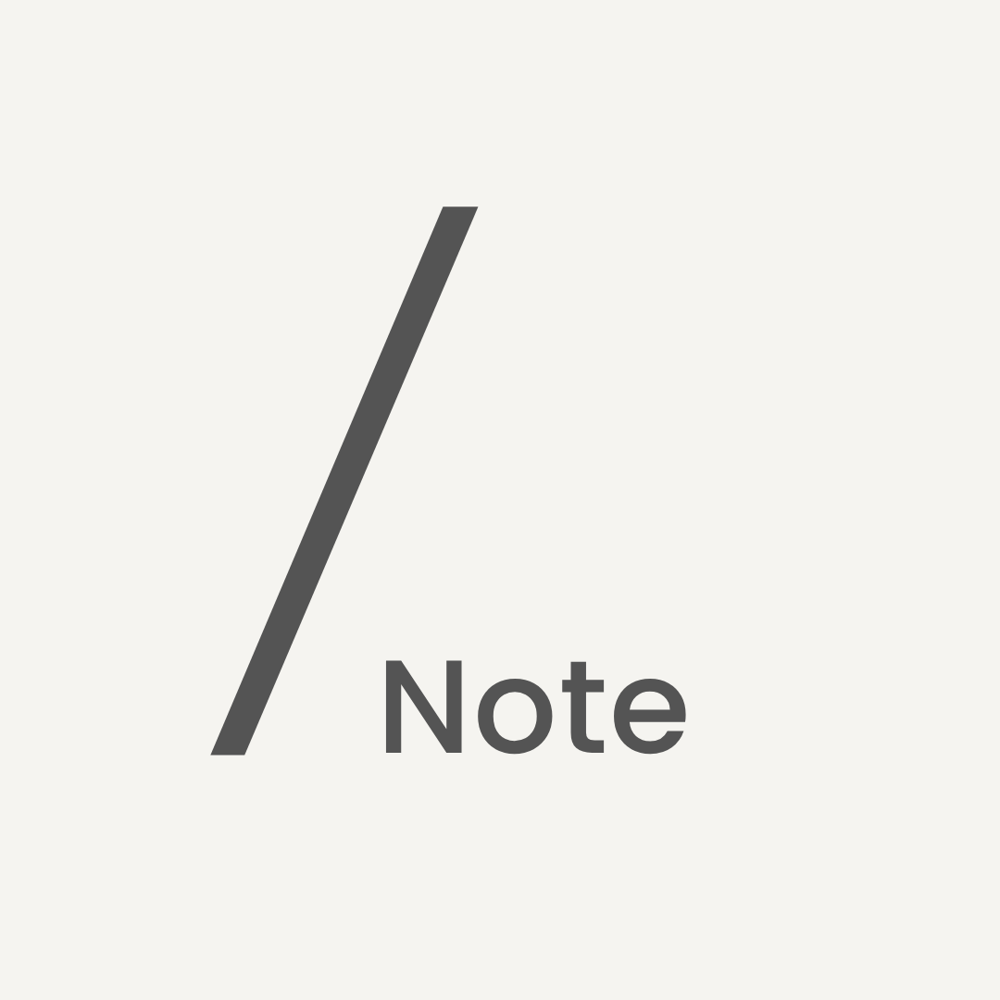

# SlashNote

<p align="center">
  
</p>

<p align="center">
  <strong>Lightning-fast, offline-first Markdown note-taking for Desktop & Android.</strong>
</p>

<p align="center">
  
  
  
  
  
  
</p>

> 💡 **Engineering Note:** The Desktop interface is adapted & edited from the open-source project _scratch_, while the mobile client is completely custom-built from the ground up by the developer.

---

## ⚡ Overview

SlashNote is a distraction-free, local-first Markdown workspace engineered for developers, researchers, and technical writers. Your notes remain 100% your own—stored as plain `.md` files on your local filesystem and synchronized securely across devices via native Git integration.

---

## ✨ Features

### 🛠️ Editor & Pro Developer Suite

- **100% Offline-First:** No accounts, no central servers, no telemetry, and zero vendor lock-in.
- **WYSIWYG & Raw Source Mode:** Seamless inline formatting with an instant toggle (`Cmd+Shift+M` / `Ctrl+Shift+M`) to edit raw Markdown.
- **KaTeX Math Engine:** Full support for inline `$math$` and display block `$$...$$` equations.
- **Mermaid Diagrams & Code Highlighting:** Render live diagrams and syntax-highlighted code blocks across 20+ programming languages.
- **Interactive Tables & Task Lists:** GitHub Flavored Markdown (GFM) task lists and interactive data tables.
- **Wikilinks & Autocomplete:** Interlink your notes with `[[wikilinks]]` and fast popup indexing.
- **Slash Commands & Focus Mode:** Instant `/` menu for inserting structural elements; Focus Mode (`Cmd+Shift+Enter`) for distraction-free writing.
- **External AI & CLI Ready:** Works seamlessly with Claude Code, OpenAI Codex, OpenCode, and local Ollama instances via native filesystem watchers.

### 🔄 Dual-Branch Native Git Sync

- **Embedded `libgit2` Core:** Powered by a shared Rust engine compiled directly into the binary—no system Git installation required.
- **Safe Dual-Branch Workflow:** Uses automated 3-way merging across branches (`main` + `vault-backup`).
- **Conflict Isolation:** Non-destructive sync that automatically writes `<stem> (Conflicted Copy <timestamp>).md` to guarantee zero data loss.

---

## 🏗️ Architecture & Tech Stack

```text
┌─────────────────────────────────────────────────────────────┐
│                       SlashNote Core                        │
│                 (Rust / crates/SlashNotes_Core)              │
│       • pulldown-cmark  • libgit2  • Tantivy Indexing       │
└──────────────────────────────┬──────────────────────────────┘
                               │
            ┌──────────────────┴──────────────────┐
            ▼                                     ▼
┌───────────────────────────┐       ┌───────────────────────────┐
│      Desktop Client       │       │    Android Mobile Client  │
│  • Tauri v2 + React 19    │       │  • Kotlin + Jetpack Compose│
│  • TipTap v3 Editor       │       │  • Mozilla UniFFI Bindings│
│  • Tailwind CSS           │       │  • Multi-Arch (ARM/x86)   │
└───────────────────────────┘       └───────────────────────────┘
```


---

## 📜 Attribution & License

SlashNote is released under the [MIT License](./LICENSE).

The Desktop client contains code derived from and substantially modified from
[Scratch](https://github.com/erictli/scratch), an MIT-licensed open-source project.

The Android client was independently developed for SlashNote.

See [THIRD-PARTY-NOTICES.md](./THIRD-PARTY-NOTICES.md) for additional
attribution and third-party licensing information.